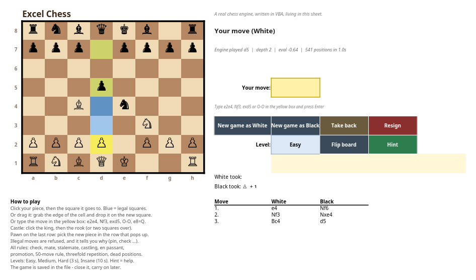

# Excel Chess

**A complete chess engine written in VBA, living inside one Excel workbook.**
Click a piece, click a square, and the engine answers. Every rule of chess is in there.



## Play it

1. Download **[`Excel Chess.xlsm`](https://github.com/eduardkuncek-crypto/excel-chess/raw/main/Excel%20Chess.xlsm)**. That one file is all you need. No add-ins, no internet.
2. Open it:
   - **Excel desktop (Windows / Mac):** click **Enable Content** in the yellow bar. If Excel says
     macros are blocked, close the file, right-click it → Properties → tick **Unblock**.
   - **LibreOffice Calc (Linux):** Tools → Options → LibreOffice → Security → Macro Security →
     Trusted Sources → add the folder the file is in, then reopen the file.
   - Excel for the web and mobile Excel can't run macros, so the board shows but won't react.

**How to move:** click one of your pieces (its legal squares turn blue), then click where it goes.
You can also drag the piece's cell, or type a move like `e2e4`, `Nf3`, `exd5` or `O-O` into the
yellow box and press Enter.

## What's in it

- **Every rule:** check, checkmate, stalemate, castling (also by clicking the king and then the rook),
  en passant, promotion with a piece picker, the 50-move rule, threefold repetition, and dead
  positions (not enough material to mate).
- **Illegal moves** are refused and explained: *"that bishop is pinned"*, *"you're in check"*,
  *"the king or that rook has already moved"*.
- **Buttons:** new game as White or Black, take back, resign, flip board, hint.
- **Levels:** Easy, Medium, Hard (thinks 3 s), Insane (10 s).
- **Move list** in chess notation, captured pieces with a material count, and the game saves
  inside the file, so you can close it and carry on later.

## The engine

- 10×12 mailbox board, pseudo-legal move generation with make/unmake and a legality check
- Negamax alpha-beta with principal variation search, iterative deepening and a check extension
- Quiescence search on captures and promotions
- Move ordering: hash move from a transposition table, MVV-LVA captures, killer moves, history heuristic
- Evaluation: material plus Tomasz Michniewski's piece-square tables, a tapered king
  (middlegame → endgame), bishop pair, and a mop-up term so won endgames actually get finished
- Zobrist hashing for repetition detection, and a 22-line opening book

### How strong is it?

Measured against **Stockfish 19** locked to a fixed rating (`UCI_LimitStrength`, 0.1 s per move),
over 38 games per match from 19 openings, each played once with each colour:

| Search depth | Result | Estimate |
|---|---|---|
| 2 half-moves | 31.5/38 vs 1320, 15/38 vs 1600 | **~1550** |
| 3 half-moves | 34.5/38 vs 1320, 18/38 vs 1700 | **~1700** |
| 4 half-moves | 37.5/38 vs 1320, 25/38 vs 2000 | **~2100** |

These are Stockfish-scale ratings, not a chess.com rating. How deep it actually searches depends
on what runs the macros: in LibreOffice Calc it reaches about 2 half-moves in 3 seconds (LibreOffice's
Basic is slow, a few hundred positions a second). Desktop Excel runs VBA much faster, but that hasn't
been measured yet.

## How it was built without Excel

Everything was written and tested on Linux, without Microsoft Excel:

- **`src/`** holds the VBA and is the single source of truth.
- **`vba2py.py`** translates the VBA into Python so the real code can be tested. It doubles as a
  linter for things that would be compile errors in Excel: undeclared names, wrong argument
  counts, unbalanced blocks, type mismatches, 16-bit Integer overflow traps, writes to ByRef
  parameters.
- **`test_chess.py`** runs perft on six standard positions (up to 422,333 nodes, all exact), compares
  5,548 random-game positions against python-chess (legal moves, FEN, SAN, game-end state),
  checks tactics, and drives the sheet logic through a fake worksheet.
- **`build.py`** writes the workbook with XlsxWriter and builds `vbaProject.bin` from scratch from
  Microsoft's specs: MS-OVBA compression, the `dir` and `PROJECT` streams, the encrypted
  protection fields, and an MS-CFB compound file. oletools reads every module back byte-identical.
- **`lo_test.py`** opens the real workbook in headless LibreOffice and plays it: clicks, typing,
  drag, take back, flip, hint, playing as Black.
- **`elo_match.py`** runs the Stockfish matches above.

LibreOffice turned up four compatibility traps, all fixed in a way that still works in Excel:
a one-line `If … Then Sub a, b Else Sub c, d` crashes its Basic compiler, `Target.CountLarge`
crashes it too, `ActiveSheet Is Sheet1` is never true, and `.Formula` returns number-looking
text with a leading apostrophe.

> **Honest status:** tested end to end in LibreOffice Calc 26.8. It has **not yet been opened in
> desktop Excel**. The macro container follows the spec and is verified with oletools and
> LibreOffice, but if Excel reports it removed the VBA project, import the files in `src/`
> (Alt+F11 → File → Import) as a fallback.

## Build and test

```bash
pip install xlsxwriter chess oletools
python3 build.py              # -> Excel Chess.xlsm
python3 test_chess.py         # rules, engine and sheet logic (about 3 minutes)
python3 lo_test.py            # end to end in LibreOffice (needs LibreOffice + its Python UNO bridge)
python3 elo_match.py /path/to/stockfish --depth 3 --elo 1700
```

## Files

```
Excel Chess.xlsm   the game
src/               VBA: Engine.bas (rules + search), Game.bas (clicks, drawing, saving),
                   XL.bas (the only code that touches Excel), sheet and workbook event hooks
build.py           builds the .xlsm and its macro container
vba2py.py          VBA -> Python translator and linter;  vbart.py is its runtime
test_chess.py      tests;  lo_test.py LibreOffice test;  elo_match.py strength test
```

## License

MIT, see [LICENSE](LICENSE). Made by Eduard Kuncek, built with Claude Code.
